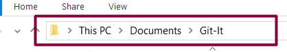
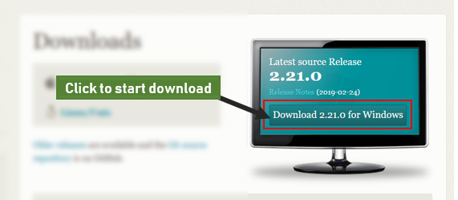
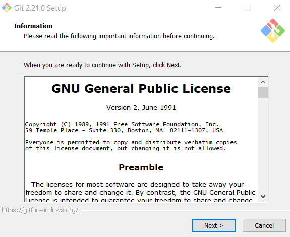
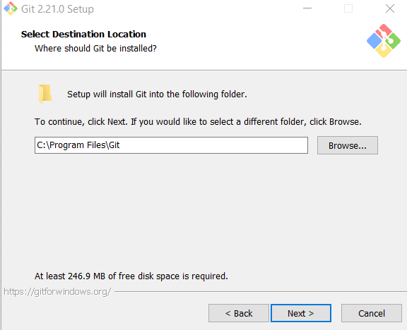
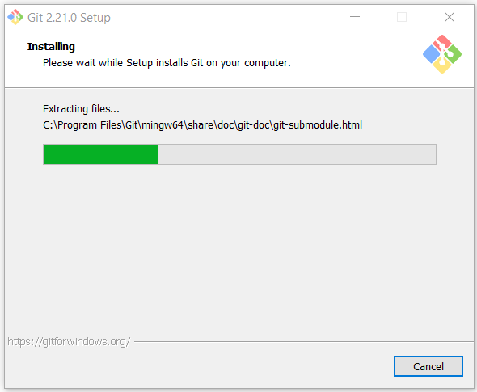

# PART 2: THE PROJECT BEGINS
In this section, we will be working on a fictional web project called **Git-It**... get it? Let's begin. 

On your system, create a folder in any location of your choice. I'd prefer you save it in your "Documents" folder for this tutorial. Name the folder "Git-It". This is the folder that will contain all the files for our project.  

  
*Screenshot of my **Git-It** folder in Documents*  

Our folder will contain the following files:  

 - git.png (an image file containing the git logo). 
 - index.html (the homepage of our Git-It project).
 - main.css (a css file to style our homepage, make it look nice).   
 > 1. Create the html and css file in your folder. Both files should be empty.  
 2. [Download Git Logo Here](https://git-scm.com/images/logos/downloads/Git-Icon-1788C.png "Download GIT logo")

We will create a simple webpage, containing a header, an image, and a short paragraph.  

And that's it, our project folder is set up - we can begin coding our project, adding lines of text to the empty files that currently sit in the folder. To implement version control in our project, let's download and install GIT.

## Installing GIT
First, go to https://git-scm.com/downloads, and click on the download link on the right.  

  

The download should begin once you click the 'Download' button. After it is done, double-click the file you downloaded to begin the installation. This will start a series of dialog boxes, where you will make some settings before GIT is installed.  

  

Click **Next** to begin.  

The next dialog box lets you select a folder on your system where you would like to install GIT. You don't need to change anything here so click **Next** to move forward.  

  

On the next screen, you can select some components you want installed with GIT. The default options are fine and don't need further tweaking. Click **Next** to continue.  

  

***

  

This dialog box lets you pick your preffered text editor. GIT is a command-line tool (more on that later), and works mostly by typing text or commands on screen. Click the drop-down to pick your text editor, or click Next to leave it as default.  
The next few dialog boxes contain features for advanced users. Click "Next" to go through them, until the installation begins.  

  

And that's it... well done!!! You have installed GIT on your system. High-five.  

  

Click __Finish__ to close the installation dialog box. Well done.

In the next class, we will talk about the command-line, and how it works with GIT. You will create your first GIT repository, and will be introduced to git commands.