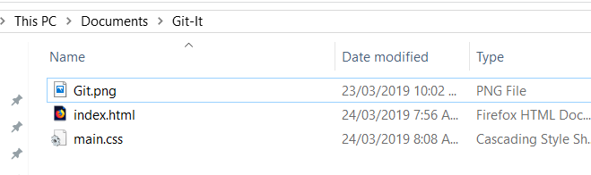
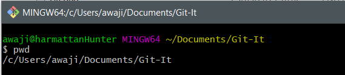
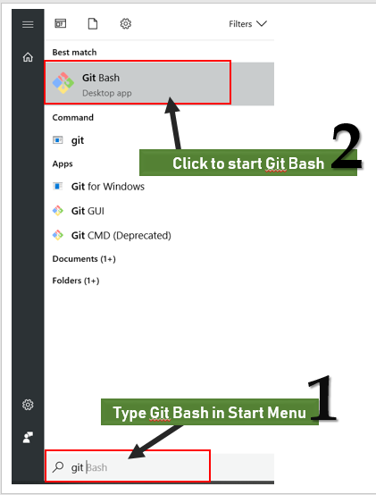
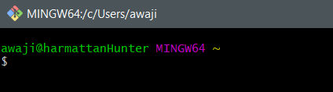
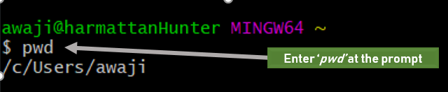

# Part 4: Repositories and Version Control

Last lesson, we learnt how to use Git Bash. We also learnt a few commands to navigate, view, and list the contents of our directories. In this lesson, we will create our first Git repo, and begin working on our project files.

> I define a software as a way of thinking, a way of doing a particular task. Understanding how **Git** thinks is very important if you want to use it properly and efficiently.

## Version Control With Git
For this lesson, we will be working in our project directory. Open Git bash and navigate to your project folder to begin.

>
    You can also start Git Bash using the Windows Explorer. 
* In Windows explorer, open your project folder  
  
*viewing the project folder in Windows Explorer...*  

* Right Click, and select "Git Bash here" to start Git Bash. This forces Git bash to use this folder as your working directory when it launches.  

  
*Starting Git bash through windows explorer...*  

* When Git Bash starts, confirm your working directory is the project directory by using the command *pwd*  

  

## Configuring Git
Be patient.. we will soon create our first repository. Before we do that, we should make some changes on our git configuration. Remember that GIT is meant for collaboration, right? How do programmers know which programmer has made changes to the project?

IDENTITIES.

Git comes along with a configuration tool that lets you set and update various information. Updating your identity is the first thing you should do after installing Git. This will be useful in the future, when you upload your repositories to GitHub.

To add your name to Git config, type the following command
`git config --global user.name "Your name" `
Fill in your name - the quotes are important.

To update your email, you type something similar
`git config --global user.email "youremail@yourdomain.com"`

To view your configuration settings, type
`git config --list`
This will display a list of all your git configuration.

Now, let's create our repository.

## Creating a repository
Git uses what we call "repositories" to store information about your project's changes. This "repository" is a special folder Git creates in your project folder, when Git is initialized.

To start Git, type `git init` in the terminal.  

[screenshot of git init with result]

Go through the output message. Type ls. Can you notice any change. Options in command line argument. ls -a. .git indicates it is a hidden folder. (all this should go in here)

You now have a git repo ( a folder where changes to your project are stored)
## Creating a repository
Open Git Bash, and navigate to your project folder. You should have something similar to the screenshot. Enter *ls* to view the contents of the directory. It should display 
- an image file (the Git logo)
- index.html file (Gitting-It homepage)
- main.css (stylesheet)  

[git bash ls contents project folder]  

To start monitoring this folder with GIT, run the command

` git init `

In our last lesson, we created a folder for our project files and installed **Git**. We also talked about the importance of version control and collaboration when building large projects.

This section is an introduction to the command line (also known as the terminal). At the end of this section, you should be comfortable using Git Bash, a special terminal for working with **Git** on Windows.

## What's the Command Line?
Modern operating systems have what we call a Graphical User Interface (GUI)... nice pretty icons and fonts that convey meaning and can respond when we 'click' or 'tap' on them. 

Years back (more like decades), computer programs weren't that fanciful. Running computer programs was mostly a text-based activity - you had to type a bunch of commands into a program called a shell/terminal/command line. This required a lot of memorization, and people who learnt these programs were considered 'professionals'. Graphical User Interface made computers more user-friendly, much easier to use.

Needless to say, most programs and software written today have a graphical interface. You use these programs by clicking on icons and buttons, and they usually come with menus and windows for writing documents, editing photos, or drawing illustrations. Microsoft Word, Photoshop and the Chrome browser are good examples.

Programs designed to run in a terminal are called command-line programs. They have no icons or buttons. You interact with these programs using commands. Git is a command-line program, although some programs now offer GUI interfaces for performing **Git** functions. This tutorial won't be teaching you how to use those - learning the command line will require a more intensive effort, but is ultimately more rewarding.

## Opening the Git-Bash Terminal
To start Git Bash, perform the following actions  
 - Click the Windows or Start icon
 - In the Programs list, open the **Git** folder
 - Click the option for Git Bash.  
You can also type 'git bash' in the Start menu, and click to start the program.  

  
*starting Git Bash...*
<pre>
</pre>

If you see the screen below, we good...  you've successfully launched the Git Bash Terminal

  
<pre>
</pre>

## Working With The Terminal
A terminal (also called a shell) is a program that lets you work with command-line programs. Think of it as a robot waiting for you to give it a command to execute. You give it programs to execute by typing in commands.

The Git Bash shell is a special terminal designed to work with Windows. Below is a short tutorial to get you started using it.

### Finding your way around the terminal
 If you have Git Bash opened, you should see a dark, blank screen with a few characters at the top.  

 
  

On the first line, you have  

`awaji@harmattanhunter MINIGW64 `

This would be different on your system. The first part (before the @) is my username on my PC. The part after the @ is the name of my computer. It's not important you know what MINIGW64 means, so we can ignore that.

So, the first line follows this format  

`user@computerName MINIGW64`

Hopefully, yours follows this format too. Let's move on.

On the second line, we have a single character.  

` $ `

This is called a prompt. It's where you will enter/type commands into the shell. We are now ready to learn a few shell commands.

## Basic Shell Commands

### The PWD Command
The first command you will learn is **pwd**. **pwd** is short for *print working directory*. The "working directory" is the folder the shell is currently residing it. This command displays the current working directory.

When you start a shell, the program takes a folder on your hard disk, and makes it its working directory. It's similar to the 'project folder' in **Git**, a point where all work takes place. 

To view your working directory, type *pwd* at the prompt and press **Enter**.  

  

When you press **Enter**, the command runs and prints a result on the next line. In my case, the shell printed

` /c/Users/awaji `

The output of this command might look confusing, but it's really easy to understand. 

When you save files on your hard disk, they are not stored randomly. Rather, they are are organized in various categories using folders(directories).

Think of a folder as a container for a group of related files. The Windows OS creates a few folders by default for organization (Documents, Music, Pictures, Scans). Windows also creates a folder on the hard disk for each user. These folders and files all reside on the hard disk.

Using this information, let's interprete the output of the *pwd* command.

The output of the 'pwd' program says (reading from right to left) I'm in a folder called 'awaji', which is in a folder called 'Users', which is stored on my hard disk, the C drive.

This means any program or command I run will use this location as a sort of reference. Let's learn a few more commands to throw some light on this.

## The LS command
The LS command (or list) shows the content of the current working directory. Enter **ls** at the command prompt to try it.

  

The ls command lists all the files and folders in our working directory. In my screenshot, it displays the contents of the 'awaji' folder. 

What if we would like to change our working directory, sort of move around or navigate through the folders on our disk?

Well, there is a command for that too.  

## The CD command
This command is also known as the 'change directory' command. You use it to navigate through your filesystem (hard disk). Let's try it.

In our last example, we ran the LS command and it printed a list of all the files and folders in our working directory. 
 
Type ` cd Documents ` to navigate to the _Documents_ folder. 

  

Type **ls** to view the contents of _Documents_. See if you can find the Git-It folder in the list. 
> __Exercise__:  

    Using the commands you have learnt so far, can you navigate to the Git-It folder?
    *Confirm you are in the Git-It folder by running the pwd command.*

> __Other info__:  

    To go to a parent folder, use the 'cd ..' command. The ".." refers to parent folder.

We now know enough about the command line to begin working with GIT. In the next lesson, we will initialize our GIT repo and begin to build our homepage.

<!-- 

## the mkdir command (make directory)

## a brief on filepath

## further study on the command line

## Initializing our GIT repository

## the git init command

## working directory, repo, and index/staging area
## the git add command

## the git commit
    seeing others (ls) (command line and modifiers)
    looking around
    moving out
    moving up
    moving down

 -->
