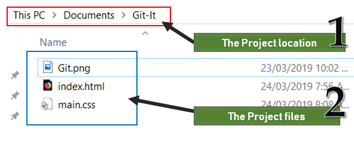
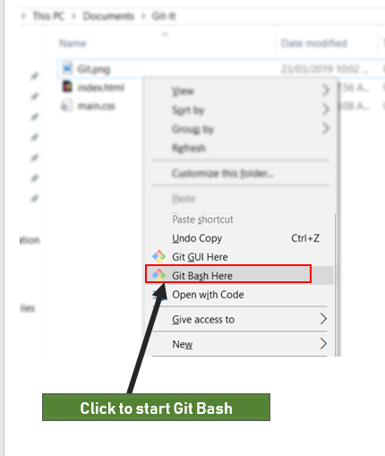
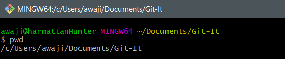
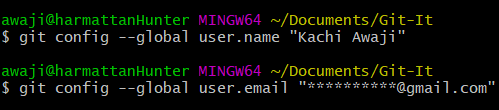
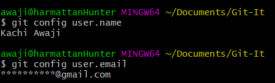
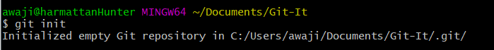
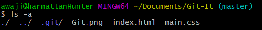

# Part 4: Repositories and Version Control

Last lesson, we learnt how to use __Git__ Bash. We also learnt a few commands to navigate, view, and list the contents of our directories. In this lesson, we will create our first __Git__ repo, and begin working on our project files.

> I define a software as a way of thinking, a way of doing a particular task. Understanding how __Git__ thinks is very important if you want to use it properly and efficiently.  

## Version Control With __Git__
For this lesson, we will be working in our project directory. Open __Git__ bash and navigate to your project folder to begin.  
> You can also start __Git__ Bash using the Windows Explorer. 
> * In Windows explorer, open your project folder  
>   
>
> * Right-click, and select "__Git__ Bash here" to start __Git__ Bash. This will cause __Git__ bash to set this folder as working directory when it starts.  
>   
> 
> * When __Git__ Bash starts, confirm your working directory is the project directory by using the command *pwd*  
>
>   

## Configuring __Git__
Be patient.. we will soon create our first repository. Before we do that, we should make some changes on our git configuration. Remember that GIT is meant for collaboration, right? How do programmers know which programmer has made changes to the project?

__IDENTITIES__

__Git__ comes along with a configuration tool that lets you set and update various information. Updating your identity is the first thing you should do after installing __Git__. This will be useful in the future, when you upload your repositories to GitHub.

To add your name to __Git__ config, type the following command  
`git config --global user.name "Your name" `  

To update your email, you type something similar  
`git config --global user.email "youremail@yourdomain.com"`  

  

To view your configuration setting, type  
`git config user.name`  or `git config user.email`

This will display the current name or email. 

  

Now, let's create our repository.

## Creating a repository
__Git__ uses what we call "repositories" to store information about your project's changes. This "repository" is a special folder __Git__ creates in your project folder, when __Git__ is initialized. Repositories are sometimes called 'repos'.

To create a git repository, in the terminal, type 

`git init`

  

The terminal prints a message saying that a git repository has been initialized in your project folder.

To see the git repo, type

` ls `

  

Wait... that didn't show anything. Where is the git repo?

### Command line arguments

Some of the commands you use in the command line will let you add options. Options are like special effects on commands; they make them do something special.

The regular 'ls' command only lists files that are not hidden. Windows allows you to hide files, so they do not show up by default. To view hidden file, you will type ls with an option '-a'. This will allow ls list all files in a folder, hidden files inclusive. 

  

The git folder has a '.' in front of it. The '.' indicates that the folder is hidden. 
This folder is for git-only. Not for you. It's where __Git__ stores and monitors the changes you make as your project grows.

In the next tutorial, we will learn how to make git work for us.
