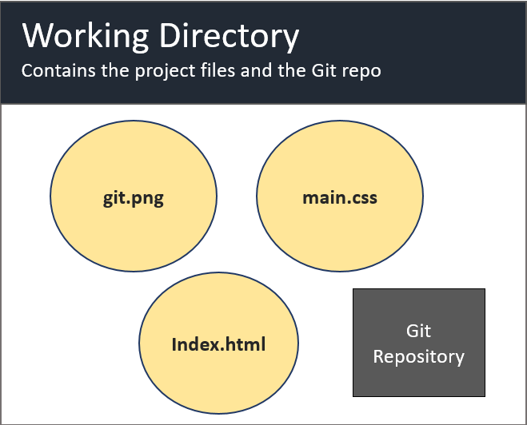
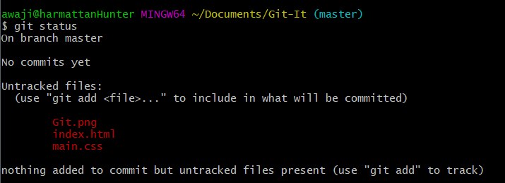
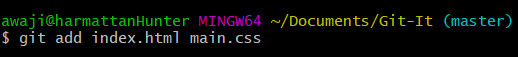

# Lesson 4: Commiting your work 

In the last lesson, we created our first repository by initializing Git in our project folder.

In this lesson, we will explore Git some more, learning a few new commands along the way. We will start working on our project files, and learn how to save (or commit) our changes in Git. 

We will talk about the index (staging area), and end the lesson by making our first commit.

## Checking the status of your repository

Last lesson, we learnt that the command 'git init' creates a repository in our project folder.  

 

`git init` creates a hidden folder - a Git repository. This is Git's home in your working folder. From here, it will monitor the files in the directory, and store information about changes they go through as the project matures. 

Let's begin by getting some information about our repository. In the command line, type `git status`. You should get an output similar to the one below.

  

The `git status` command prints a message that will be very confusing at first; will feel like reading Chinese. Let's go through it line-by-line. 

- The first line of the message says  
` On branch master `

We will talk about branches in more detail in a future lesson. But for now, note that all git projects begin on a branch called master.

- The second line says 
`no commits yet`

Saving changes to your project on Git is called 'commiting' the changes. This messages shows we haven't made any commits to our repository yet. When we do make our commit, this will be updated.

- Next, there's a heading
`Untracked files: `
A short message follows it. That will be explained soon. For now, notice the three files in our project folder are shown in red.

When you intialize Git, you also have to tell Git what files to monitor in your project folder. Files that you ask Git to watch in your project folder are called __TRACKED FILES__.

We haven't begun tracking any files in our project. To begin tracking files in our project, we use the `git add` command.

Let's talk about this command a bit more; learning how to use this command is essential. 

Imagine GIT has a list. On this list, he has the names of files in your project that you have asked him to 'track'. 

This list is empty when the repository is initialized. To add files to this list, you use the 'git add' command.

Alright, less talking. Let's do an example.

In our project folder, let's tell Git to track changes to our index.html and main.css files.

