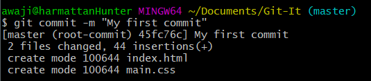
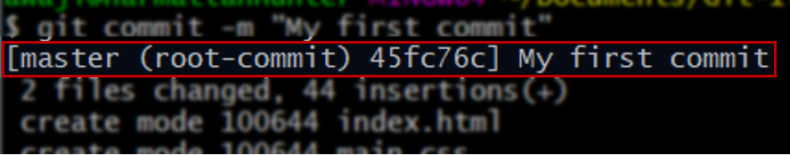
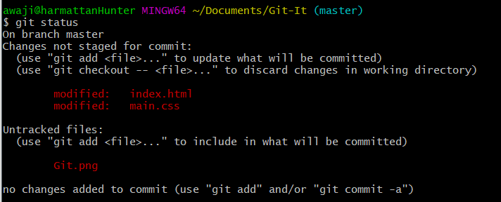
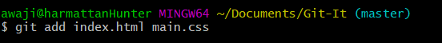
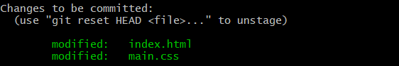
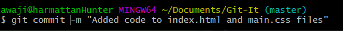
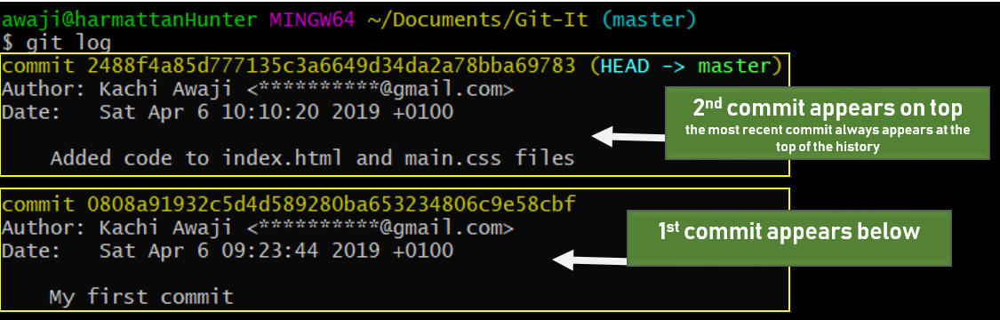
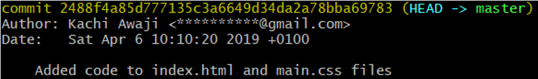

# Commiting your work 

Last lesson, we created our first repository by initializing __Git__ in our project folder.

In this lesson, we will explore __Git__ some more, learning a few new commands along the way. We will start working on our project files, and learn how to save (or commit) our changes in __Git__. 

We will talk about the index (staging area), and end the lesson by making our first commit.


## Checking the status of your repository

The `git init` command creates a repository in your working directory (project folder).  

 

`git init` creates a hidden folder - a __Git__ repository. This is __Git__'s home in your working folder. From here, it will monitor the files in the directory, and store information about changes they go through as the project progresses. 

Let's begin by getting some information about our repository. In the command line, type `git status`. You should get an output similar to the one below.

  

The `git status` command prints a message that will be very confusing at first; it will feel like reading Chinese. Let's go through the important lines.

 1. ` On branch master `

We will talk about branches in more detail in a future lesson.  All git projects begin on a branch called master.

 2. `no commits yet`

Saving changes to your project on __Git__ is called 'commiting' the changes. This messages shows we haven't made any commits to our repository yet. When we do make our commit, this will be updated.
 
 3. `Untracked files: `  
   
Notice the three files highlighted in red? Recognize them?

When you intialize __Git__, you also have to tell __Git__ what files to monitor in your project folder. Files that you ask __Git__ to watch in your project folder are called __TRACKED FILES__.

We haven't begun tracking any files in our project. To begin tracking files in our project, we use the `git add` command.


Let's talk about this command a bit more... it is one of the most important Git commands to learn.

Imagine __Git__ has a list. On this list, it has the names of files in your project that you have asked it to 'track'. 

This list is empty when the repository is initialized. You will use the 'git add' command to include files on this list.

Alright, less talking. Let's do an example.

In our project folder, let's tell __Git__ to track changes to our index.html and main.css files.


Check the status again.  

  

Notice the status has been updated.
 - No commits on the repository yet.
 - There are two lines of green text below the "Changes to be committed" heading. These are the files we have 'staged' to be committed. The 'new file:' in front of the filenames indicates this is the first time we will be adding the files to the repository.
- The 'git.png' file is not being tracked. It won't be added to our commit.  

We are now ready to make our first commit.

# __Git__ Commit
A commit is like a savepoint in your project. You are essentially saying "My files are this way now. They may go through some changes in the future. I want to be able to return to the way they are now."

To commit the files you staged (using the `git add` command is sometimes known as _staging changes_), type  

`git commit -m "Commit title"`  

Let's go through our new command.

The 'git commit' command saves our changes to the local repository - 'local repository' here meaning the hidden git folder on in your project.

For the most part, working with __Git___ will be following these steps.
1. Make changes to the files in the working directory.

2. Add the files to the index(stage changes you want to commit)  

3. Commit.  

This is the basic __Git__ workflow. Each git commit you make is a different version of the project... and __Git__ stores these versions so you can go back to them, if you need to. That's the beauty of version control with __Git__.

Every __Git__ commit should have a message attached, that describes what the commit is about -- a short description of the changes you have made. This is important, as you would be working on the project with other programmers. The descriptions you enter will give them a clear picture of your contributions.

Using only the 'git command' would open your text editor. This will let you type in your description before the commit is complete. This can be confusing sometimes. The -m option is an easier command to learn.

Using the `-m` option lets us type in our description at the end of the command. One thing is important though - the description must be in quotation marks ("").

Alright, let's make our first commit.

`git commit -m "My first commit"`  

  

The commit command prints a message showing information about itself. Our focus will be on the first line. 

  

The output indicates that we have commited our changes to a branch called _master_. We will talk about branches in a future lesson, but it's good to remember that every git repository begins on a _master_ branch.

_(root-commit)_ signifies that this is our first commit. On its' right, there is what looks like a bunch of random numbers and letters. What you have on your system would probably be different from mine. What do they mean?

Every time you make a commit, __Git__ gives that commit a special name to identify. This name is generated using your content, and will uniquely identify the commit in the repository. Technically, it is called a __SHA-1 hash__.

## Working on our project files
Next, we will begin to add code to our files. Add the code below to your project files.

- _Add this to your index.html_  
```
<!DOCTYPE html>
<html lang="en">
<head>
    <title>Git-It</title>
    <link rel="stylesheet" href="main.css">
</head>
<body>
    <h2>Learning Git</h2>
    
    <p>The most popular version control software</p>
</body>
</html>

```

- _Add this code to your main.css_  
```
html, body{
    padding: 0;
    margin:0;
}

body{
    background-color: #29163b;
    padding-top: 40px;
}

h2{
    color: #e7dcf2;
    font-size: 48px;
    text-align: center;
    letter-spacing: 4px;
    text-transform: uppercase;
}

img{
    display: block;
    margin: 0 auto;
    width: 15%;
    text-align: center;
}

p{
    text-align: center;
    color: #bbbb73;
    letter-spacing: 4px;
    font-size: 16px;
    text-shadow: 1px 1px 1px #1d1111;
}

```
Our files now have some code. You can double-click the _index.html_ file to view the webpage in your browser. Type 'git status' to see updated information about the repository.  

  

Our status now indicates we have made changes that have not yet been staged. Both files have been marked as modified. It also notes we have one untracked file (our git logo).

Let's stage our changes, and make a new commit.

` git add index.html main.css `  

  

> The `git add` command also lets you add multiple files at once. Just list them after 'git add' and put a space before each file name.

Running `git status` again will show the files have been staged, and are ready for commit.  

  

We are now ready to make our second commit. Let's do that.  

`git commit -m "Added code to index.html and main.css files"`  

  
> Remember, your commit message should be a short description of your changes and work on the project.

Now, we have two commits in our repository. The commits are a history of our project, and you can use the `git log` command to view your repo's history.

Type 'git log' in the command line.  

  
> The list shows the most recent commit at the top. 

Let's take a look at our most recent commit.  

  

At the top, it shows the __SHA-1 hash__ of the commit. The __SHA-1 hash__ usually contains about 40 characters. You don't have to memorize or use the full hash, you can use the first seven characters to identify the commit. We will use the hash when we want to revert our project to the way it was at a particular commit.

It also shows the author of the commit, and author's email. The date and time the commit was made is also shown. 

At the bottom is the description/message you tagged along the commit - in this case, _"added code to index.html and main.css files"_.


So far, so good. This lesson was a long one. We started using version control on our project, and made our first commits. 

In the next lesson, we will continue working our project, making changes and adding new commits. See you soon.