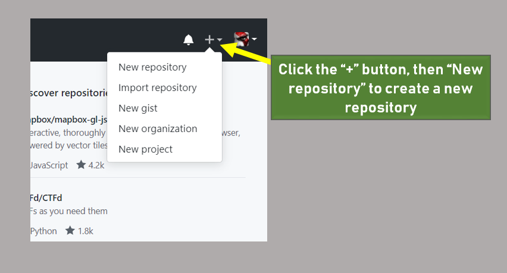
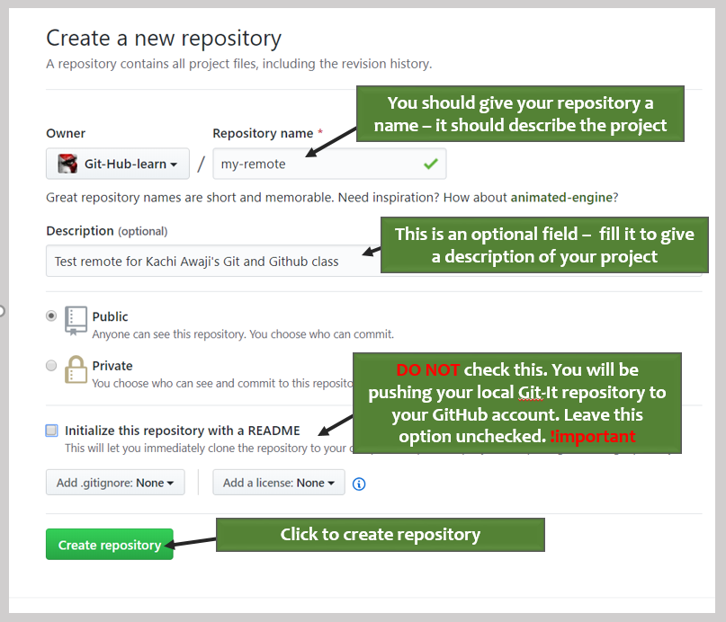
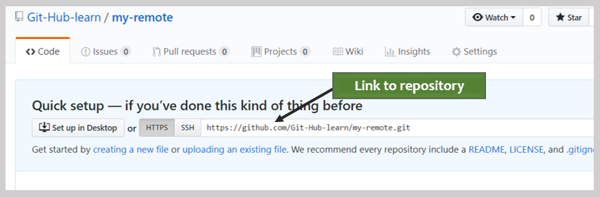
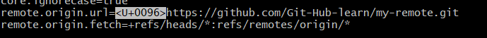
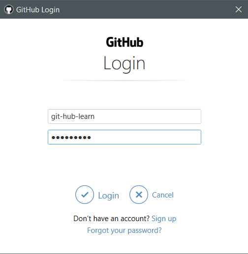
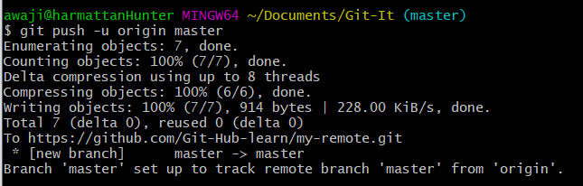
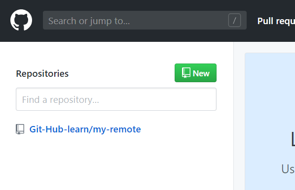
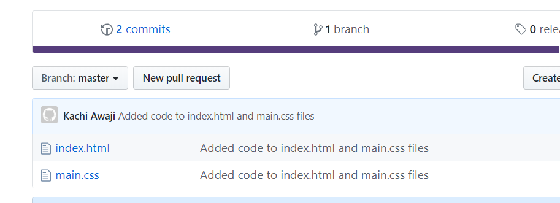

# Working with remote repositories

In the previous section, we created a local repository and made our first commits. We also learnt to use the `git commit` command to save changes to the repository, and learnt the `git log` command for viewing our repo's history.

What if you'd like to share your repository with other programmers? You can do that using __Git__ and an online service that lets you host __Git__ repositories. In this lesson, we will learn to create remote repositories using __GitHub__, an online code-hosting platform.

__Git__ is a _distributed_ VCS (version control system). This means the git repository in your project folder can be shared with others, and they can work on your files and make changes as they wish on their own systems. This will let them have not just access to your files, they'd also be able to view the history of the project too(view the commits you have made). You can share your repository with others by hosting them online.

Some services that let you host repositories online include __GitHub__, __Bitbucket__, __GitLab__ and a few others. GitHub is the most popular and will be our focus in this series.

## Using GitHub
To host repositories on __GitHub__, create an account by visiting [their website](https://www.github.com). You should verify your account too; click on the link in an email that will be sent to you after you register.

For this series, I have created an account on __GitHub__ called Git-Hub-Learn. It will host repositories for the series which you will be working with later.

When you create a repository on your system using __Git Bash__, the repository is stored on your PC. __GitHub__ lets you create repositories that are hosted on its servers...

## Creating a repository on GitHub
To create a repository on GitHub, in the upper-right corner of any page, click the __+__ symbol to get a drop-down. Click _New repository_ to create a repository.  

  

  

You can choose to make your repository either public or private. Public repositories are visible to the public, while private repositories are only accessible to you, and people you share them with.

Congratulations! You've successfully created your first repository on __GitHub__. 

Next, we will link our local repo with our remote repo so our project will be accessible to others. 

## Linking your local repo to a remote repo
So, you have a __Git__ repository sitting on your system. Now you want to share your project to the world, so others can have a copy on their systems. 

Believe it or not, all you need is two commands to do so. The `git remote add` command lets you connect one local repository to a remote one. It takes two other values - a repo name(the remote repo is usually called origin), and a link to the remote repository.

The link to the remote repository is shown on GitHub. 

  

> Repo links on __GitHub__ usually follow a pattern   
 the URL to github.com : https://github.com/  
 your user name : Git-Hub-learn/  
 the repo name : my-remote.git  

so, to link our Git-Hub repo, Git bash into your project folder and type

`git remote add origin https://github.com/Git-Hub-learn/my-remote.git`

That's all. The command line doesn't print any output so you might not notice any change. To see the changes, type `git command --list`. At the bottom of the output, you should see  _remote.origin.url_ which contains a link to your remote repository.  

  

Next, we will 'push' our local repo to our hosted one. A 'push' moves the commits in your local repository, to the remote repository. 

Use the `git push origin master` command to push your local save to __GitHub__. _origin_ indicates we are pushing the changes on our _master_ branch to our remote repository. 

  

This will cause Git Bash to show you a __GitHub__ login screen. Enter the username and password of the account you created on __GitHub__, then click _Login_.

If all goes well, you should see a similar output.

Now, go back to your profile on [__GitHub__](https://www.github.com), and click on the repository. __GitHub__ displays a list of your repositories on the left of the screen.

Your repository has been updated, and the files you pushed are available online.

> Note the git.png is on your GitHub. This was because it wasn't include in the commits. The files in the working directory on the repository are generated from the commits in the .git folder. 

So far, so good. You've learnt how to host your repositories on __GitHub__. Next, we will learn how to download repositories from __GitHub__ to our local system.